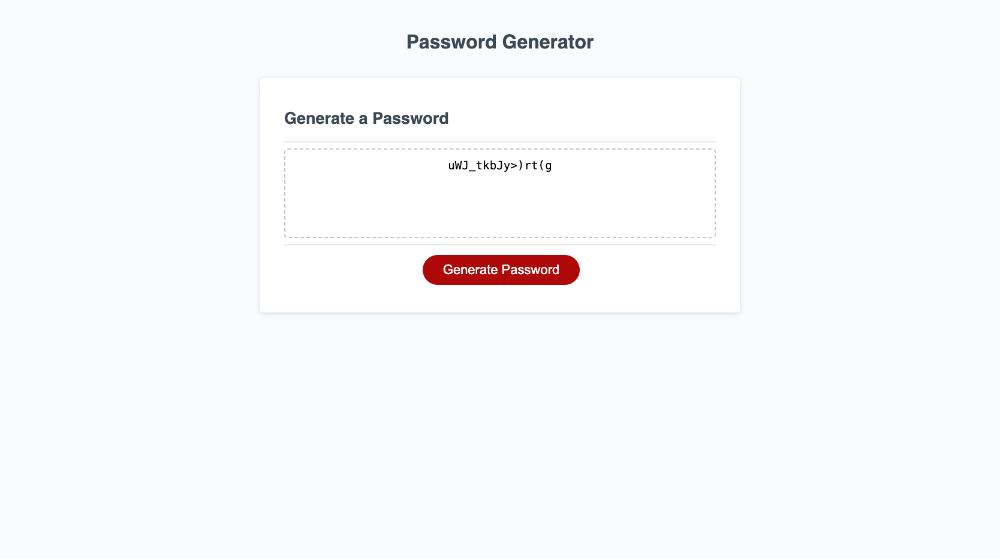

# password-generator

## Description 

The need for this project is to learn how a basic random password generator functions.
I built this to understand how variables are chosen at random from a string or array and how to alert a user of any potential conflicts or issues from criteria set forth. This application serves a standard guide and a structure for how password generators should function. From the build I learned how to use boolean statements with operator assignments, how to use a function, 'for' loop usage, global vs local variables, and user alerts prompts.

## Link to deploy app

[Password Generator][def]

[def]: https://nicoinlalaland.github.io/password-generator/